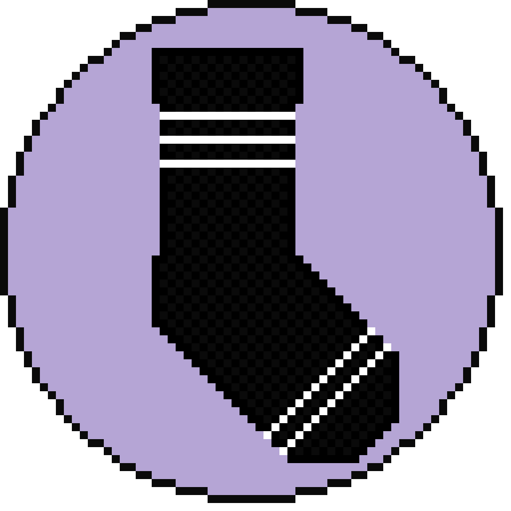

<p align="center">

</p>

# Right Sock

Right Sock is a simple, lightweight, object-oriented, C++ wrapper library for networking using sockets.

It supports multiple platforms, such as Windows, Linux, or Android.

## Dependencies

CMake 3.25 is required, however after modifying the first line in the main `CMakeLists.txt` file, it will probably work fine on older versions either.

The library doesn't use any external dependencies outside of C++20.

## Build

To build the library, use your preferred CMake tools (like GUI or toolkit provided by VS Code), or just use the terminal.

```powershell
> cd build
> cmake -DBUILD_EXAMPLES=[ON/OFF] ..
```

## Usage

For usage cases, head to the `examples` directory for simple showcase.
